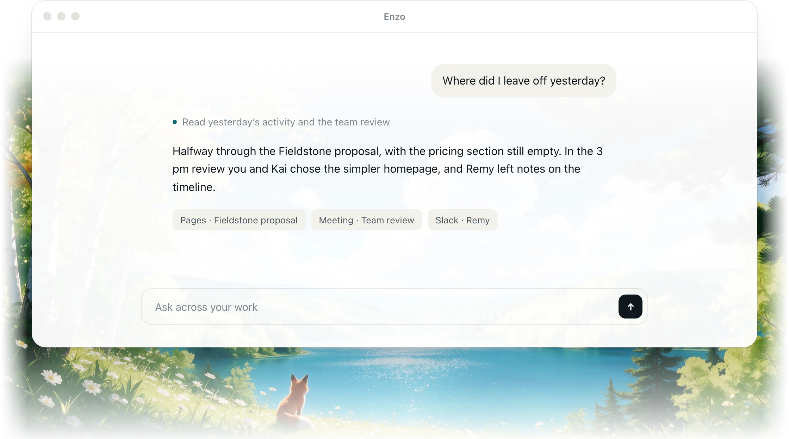
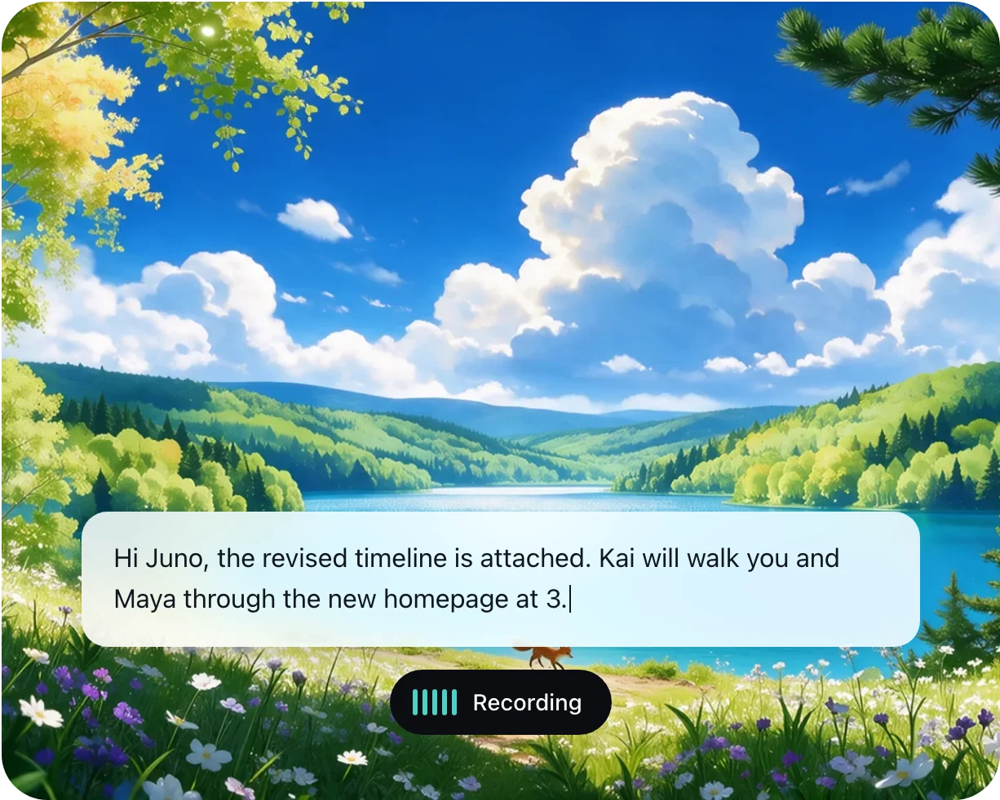
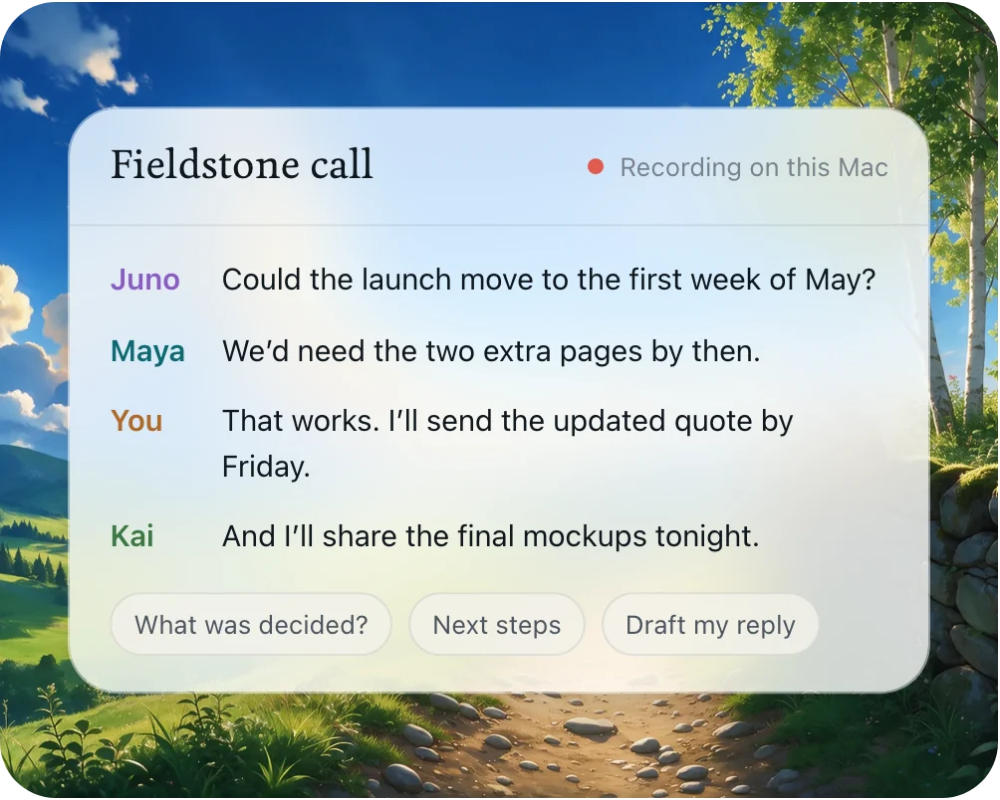
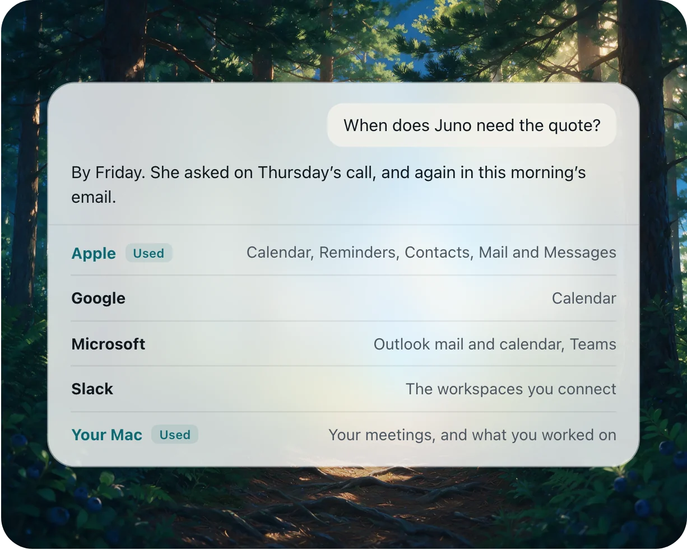

  <a href="https://tryenzo.ai">
    <picture>
      <source media="(prefers-color-scheme: dark)" srcset=".github/readme/enzo-lockup-light.svg">
      
    </picture>
  </a>

<h3 align="center">Your superhuman assistant.</h3>

  Enzo types what you say, sits in on your meetings, 
  and answers questions about your work. Your history stays on your Mac.

  <a href="https://github.com/selcamx/enzo/releases/latest">
    <picture>
      <source media="(prefers-color-scheme: dark)" srcset=".github/readme/download-light.svg">
      
    </picture>
  </a>

  Free, no card needed &nbsp;·&nbsp; Apple silicon &nbsp;·&nbsp; macOS 15 or later

  <a href="https://tryenzo.ai">Website</a> &nbsp;·&nbsp;
  <a href="https://tryenzo.ai/pricing">Pricing</a> &nbsp;·&nbsp;
  <a href="https://tryenzo.ai/privacy">Privacy</a> &nbsp;·&nbsp;
  <a href="https://tryenzo.ai/releases">Release notes</a> &nbsp;·&nbsp;
  <a href="https://github.com/selcamx/enzo/issues">Get help</a>

 

  

> [!NOTE]
> **Enzo 2.0 is on its way.** This page describes Enzo 2.0. Until it ships, the
> download is **Chirp 1.5.4**, the app Enzo replaces, and it updates to Enzo in place.

 

## Type at the speed of sound

Press a key, talk, press it again. Clean, punctuated text lands at your cursor
in any app on your Mac.

  

Unlimited on every plan &nbsp;·&nbsp; Works offline &nbsp;·&nbsp; In any app on your Mac

 

## Sits in on every meeting

Enzo records from your Mac, so no bot joins the call. It knows who said what,
answers while the call is on, and writes the notes after.

  

Zoom, Meet, Teams and FaceTime &nbsp;·&nbsp; Who said what, by name &nbsp;·&nbsp; Ask about the call while it’s on

 

## Already knows your apps

Connect your calendar, mail, Teams or Slack, and Enzo answers from them
alongside your meetings and what you worked on. Every answer shows where it
came from. With **Recall** on, it also remembers the apps, titles and text you
worked with (never screenshots), so you can find the proposal you had open
last Tuesday.

  

Nothing to explain or paste in &nbsp;·&nbsp; Sources with every answer &nbsp;·&nbsp; You choose what it can read

 

## Keeps everything to itself

  

**Your recordings never leave your Mac.** Recordings, transcripts, chats and
Recall are stored on your Mac and never synced or uploaded. Transcription runs
there too, so audio never goes anywhere.

**When you ask, only the question goes out.** With the context it needs, chosen
on your Mac. Enzo’s service passes it to an AI provider and keeps neither the
question nor the answer.

**Nothing watches until you turn it on.** Recall and automatic notes start off.
Pause them, keep apps and sites out, or delete what they saved, whenever you like.

[How Enzo handles your data →](https://tryenzo.ai/privacy)

 

## Plans

Free, no card needed. Dictation and meetings are unlimited; you pay only for more AI.

| | Free $0 | Plus $10 a month | Pro $20 a month |
| :-- | :-: | :-: | :-: |
| Dictation, even offline | Unlimited | Unlimited | Unlimited |
| Meeting recording, no bot | Unlimited | Unlimited | Unlimited |
| Who said what, by name | ✓ | ✓ | ✓ |
| AI usage* | Included | 2× Free | 2× Plus |
| Max, for harder questions | A small share | 6× Free | 3× Plus |
| Chat answers from | Last 7 days | All your history | All your history |
| Meeting notes | Meetings you choose | After every meeting | After every meeting |
| Brief before each meeting | | ✓ | ✓ |
| Replies drafted after meetings | | ✓ | ✓ |
| Questions using connected apps | 5 a day | 25 a day | No limit |
| Routines on a schedule | | | ✓ |

**Try Plus free for 14 days.** Your card is charged when the trial ends unless
you cancel. Paying yearly saves 15%. Plans are chosen and managed in the app.

*Usage renews every 5 hours, within a weekly limit. Long questions and Max use more.

 

## Questions

<b>How do I get started?</b>

 

Download Enzo, sign in with Apple, Google or an email code, and allow the
permissions it asks for. Enzo downloads its speech models (about 630 MB), and
then you can press your dictation key and talk. The free account applies your
plan and measures AI usage; it never holds your recordings or chats.

<b>Does it work offline?</b>

 

Dictation, recording and transcription do, once the models are downloaded.
Chat and other AI features need a connection.

<b>Which languages does it support?</b>

 

English, for dictation and meetings.

<b>Will Enzo send things on its own?</b>

 

No. Enzo drafts replies, reminders and calendar events, and creates or sends
one only when you confirm it.

<b>I use Chirp. What happens to it?</b>

 

Enzo is the new name for Chirp. Enzo 2.0 replaces Chirp on your Mac and moves
your recordings and settings over on first launch. What you bought from Chirp
carries over. Plus and Pro are optional, and nobody is moved onto a paid plan
automatically. Older release notes still say Chirp, because that was the name
at the time.

 

## Support

Found a bug or want something changed? [Open an issue](https://github.com/selcamx/enzo/issues).
For private support, billing or your account, email
[hello@tryenzo.ai](mailto:hello@tryenzo.ai).

This repository holds Enzo’s releases and issue tracker. Enzo is a commercial
app; its source code isn’t published here.
